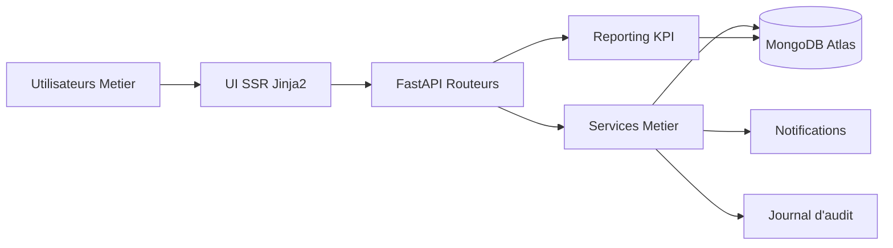
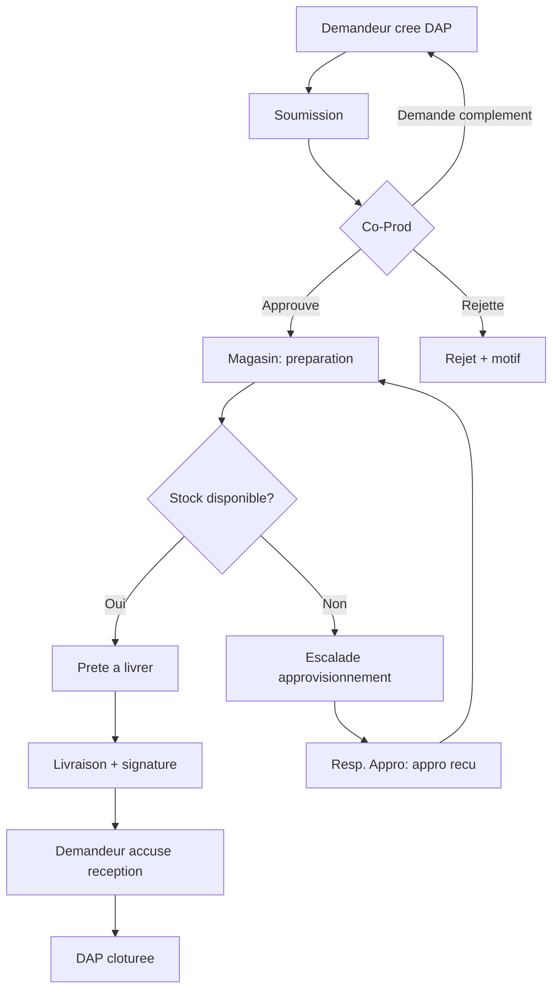

# Plateforme DAP ONCF - Rapport Technique et Fonctionnel Complet

Application web de digitalisation du cycle de Demande d'Approvisionnement de
Pieces (DAP) pour l'atelier EMIZ / ONCF. La solution couvre la chaine metier
de bout en bout, de la creation de la demande jusqu'a la cloture apres
livraison signee, avec controle de role, auditabilite, notifications et
reporting KPI.

> Projet de Fin d'Etudes (PFE) - Mohamed Mobine El Hajji  
> ENSA Marrakech - Faculte Cadi Ayyad - 2026

---

## 1. Resume executif

La plateforme DAP repond a un besoin metier central dans les ateliers
ferroviaires:

- Reduire les delais de traitement d'une demande de piece.
- Eliminer les pertes d'information liees au papier et aux echanges informels.
- Standardiser les validations inter-services (atelier, co-production,
  magasin, approvisionnement).
- Assurer une tracabilite fiable pour les decisions, livraisons et escalades.
- Produire des indicateurs de performance exploitables par le management.

L'application est concue en rendu serveur (FastAPI + Jinja2), sans chaine de
build front, avec MongoDB Atlas comme persistance cloud. Cette architecture
facilite l'exploitation, reduit la complexite DevOps et convient a un
deploiement gratuit (Render/Railway/Vercel).

---

## 2. Contexte ONCF et problematique terrain

Dans un environnement de maintenance ferroviaire, les pieces de rechange sont
critiques pour la continuite de service. Les difficultes frequemment
rencontrees sont:

- Demandes incompletes ou non standardisees.
- Retards de validation faute de visibilite partagee.
- Ruptures de stock detectees tardivement.
- Faible visibilite sur les responsabilites et les SLA.
- Difficulte a produire des KPI fiables pour l'encadrement.

La plateforme DAP propose un modele cible "workflow pilote par etats" aligne sur
l'organisation metier ONCF cote atelier, magasin et approvisionnement.

---

## 3. Objectifs de conception

### 3.1 Objectifs fonctionnels

- Dematerialiser entierement le cycle DAP.
- Imposer des regles de validation par role.
- Traiter les cas nominaux et exceptions (rupture de stock).
- Fournir une vision temps reel par role.

### 3.2 Objectifs non fonctionnels

- Simplicite d'exploitation (stack legere, SSR, pas de build front).
- Securite minimale solide (sessions signees, mots de passe hashes PBKDF2).
- Portabilite cloud gratuite.
- Observabilite applicative (logs de demarrage, endpoint health, audit).

---

## 4. Stack et choix technologiques

| Couche | Technologie | Raison du choix |
|--------|-------------|-----------------|
| Backend | FastAPI (Python 3.11+) | Rapidite de developpement, routes explicites, integration facile avec templates |
| Rendu | Jinja2 (server-side) | Simplicite, SEO naturel, cout JS reduit |
| Front | HTML/CSS/JS vanilla | Maitrise fine, zero build, charge faible |
| Donnees | MongoDB Atlas + pymongo | Schema souple, cloud pret a l'emploi |
| Auth | Session cookie signee + PBKDF2-HMAC-SHA256 | Securite correcte sans dependances natives lourdes |
| Visualisation | Chart.js + Lucide (CDN) | KPI et lisibilite UI |

---

## 5. Architecture logique de la solution

### 5.1 Vue d'ensemble



### 5.2 Decoupage en couches

- Couche presentation: templates + assets statiques.
- Couche routage: orchestration des ecrans et endpoints JSON.
- Couche metier: workflow, transitions, notifications, audit, enrichissement.
- Couche donnees: acces Mongo, compteurs auto-increment, seed de demonstration.

---

## 6. Conception metier: roles, responsabilites et gouvernance

### 6.1 Roles implementes

| Role | Code | Responsabilite principale |
|------|------|---------------------------|
| Demandeur | DEMANDEUR | Saisie DAP, soumission, reception finale |
| Coordinateur Production | CO_PROD | Approbation, rejet, demande de complement |
| Gestionnaire de Stock | GEST_STOCK | Preparation, pret livraison, livraison, signalement rupture |
| Responsable Approvisionnement | RESP_APPRO | Traitement escalades rupture et retour en preparation |
| Administrateur | ADMIN | Referentiels, utilisateurs, audit, pilotage global |

### 6.2 Principe de gouvernance

- Toute action est conditionnee par un couple (role, statut source).
- Toute transition valide genere automatiquement:
  - une mise a jour de statut,
  - une ligne d'historique sur la DAP,
  - une entree d'audit,
  - des notifications contextuelles.
- Les acces ecrans sont filtres en navigation et renforces cote serveur (RBAC).

---

## 7. Workflow ONCF digitalise

### 7.1 Processus cible dans l'atelier



---

### Flux métier (machine à états)

```
BROUILLON ──soumettre──▶ EN_ATTENTE_APPRO ──approuver──▶ APPROUVEE
                              │                              │
                       rejeter│              demarrer_preparation
                              ▼                              ▼
                          REJETEE                      EN_PREPARATION
                                                   │           │
                                          marquer_pret    signaler_rupture
                                                   ▼           ▼
                                            PRETE_A_LIVRER  EN_ESCALADE_APPRO
                                                   │           │
                                              livrer      appro_recu (▶ EN_PREPARATION)
                                                   ▼
                                                LIVREE ──accuser_reception──▶ CLOTUREE
```

Chaque transition est contrôlée par le **rôle** et le **statut source**, génère
une **entrée d'audit**, une **notification** au destinataire concerné, et — à la
livraison — **décrémente le stock** des pièces livrées.

---


### 7.2 Vision operationnelle ONCF

Le workflow modelise une separation claire des responsabilites inter-services:

- Atelier: expression du besoin et validation de reception.
- Coordination production: priorisation et controle de conformite metier.
- Magasin: execution logistique de la preparation/livraison.
- Approvisionnement: resolution des indisponibilites (escalade).
- Administration: maintien des referentiels et audit transverse.

Cette structuration reduit les ambiguites de responsabilite et ameliore la
tracabilite decisionnelle.

### 7.3 Statuts et transitions implementes

- Statuts: BROUILLON, EN_ATTENTE_APPRO, APPROUVEE, REJETEE, EN_PREPARATION,
  PRETE_A_LIVRER, LIVREE, CLOTUREE, EN_ESCALADE_APPRO, ANNULEE.
- Actions: soumettre, annuler, approuver, rejeter, demander_complement,
  demarrer_preparation, marquer_pret, signaler_rupture, livrer,
  accuser_reception, appro_recu.

---

## 8. Mecanique interne des transitions

La fonction centrale de workflow est l'equivalent d'un moteur de machine a
etats. Pour chaque action:

1. Verification de l'existence de l'action.
2. Verification du role acteur.
3. Verification du statut source.
4. Validation de champs obligatoires (motif rejet, motif rupture, message).
5. Mise a jour des horodatages metier:
   - soumiseAt,
   - approuveeAt,
   - livreeAt,
   - clotureeAt.
6. Mise a jour de l'historique embarque dans la DAP.
7. Ecriture en base.
8. Ajustement du stock a la livraison (decrement sur quantites livrees).
9. Ecriture audit.
10. Emission de notifications ciblees.

Cette approche garantit l'atomicite logique du passage d'etat.

---

## 9. Modele de donnees (MongoDB)

### 9.1 Collections principales

- unites
- users
- pieces
- daps
- notifications
- audit
- counters

### 9.2 Structure fonctionnelle simplifiee

| Collection | Champs cles |
|------------|-------------|
| unites | id, code, libelle |
| users | id, nom, prenom, email, role, uniteId, actif, password, telephone, prefs |
| pieces | id, code, designation, famille, fournisseur, stockActuel, seuilMini, actif |
| daps | id, reference, demandeurId, uniteId, priorite, statut, lignes, history, timestamps |
| notifications | id, userId, type, titre, contenu, dapIdRef, lu, createdAt |
| audit | id, userId, action, entite, entiteId, payload, createdAt |
| counters | _id, seq |

### 9.3 Conception des identifiants

- Les ids metier sont des entiers sequentiels (compteurs) pour simplifier les
  references inter-collections.
- La reference DAP suit le format: DAP-YYYY-MM-#####.

### 9.4 Jeu de donnees seed (demo)

- 5 unites.
- 20 utilisateurs (dont comptes inactifs).
- 200 pieces (5 familles, niveaux de stock varies).
- 50 DAP reparties sur tous les statuts.
- 30 notifications.
- 80 evenements d'audit.

Le seed est idempotent: purge puis reconstruction coherente des collections.

---

## 10. Securite et controle d'acces

### 10.1 Authentification

- Session basee sur cookie signe (SessionMiddleware).
- Mot de passe hashe PBKDF2-HMAC-SHA256 (120000 iterations).
- Verification constante-time via hmac.compare_digest.

### 10.2 Autorisation

- Controle d'acces par dependances serveur (require_user, require_roles).
- Filtrage complementaire de la navigation par role.
- Retour 403 sur acces non autorise.

### 10.3 Mesures de prudence

- Secrets uniquement via variables d'environnement.
- .env non versionne.
- Rotation recommandee immediate si fuite de credentials Atlas.

---

## 11. Ecrans et parcours utilisateur

### 11.1 Inventaire des ecrans metier

- Auth: connexion, deconnexion, changement de role demo.
- Dashboard: vue contextualisee par role.
- DAP: liste, creation, edition brouillon, detail, actions.
- Approbation: file Co-Prod + approbation en masse.
- Stock: kanban, deplacement d'etat, ecran de livraison (signature + quantites).
- Escalades: liste + detail + resolution.
- Reporting: KPI + endpoint JSON pour graphiques.
- Admin: referentiel pieces, referentiel utilisateurs, audit.
- Divers: notifications, profil, credits, erreurs 403/404.

### 11.2 Recherche globale

Endpoint /search (JSON) avec autocompletion sur:

- DAP (reference, OT, justification).
- Pieces (code, designation).
- Utilisateurs (visible pour ADMIN).

---

## 12. KPI et logique analytique

### 12.1 KPI principaux

- Lead time moyen (creation -> livraison).
- Taux d'approbation en moins de 4h.
- Taux de rupture (DAP en escalade).
- Distribution des statuts.
- Top pieces demandees.
- Top demandeurs mensuels.

### 12.2 Formules

- Lead time moyen = moyenne(minutes(createdAt, livreeAt)).
- Taux appro < 4h = (nb DAP approuvees en <= 240 min / nb DAP traitees) x 100.
- Taux rupture = (nb DAP EN_ESCALADE_APPRO / nb DAP total) x 100.

### 12.3 Scoping par role

- Demandeur: ses DAP uniquement.
- Co-Prod: DAP de son unite.
- Autres roles: perimetre global.

---

## 13. Structure du code

```text
app/
├── main.py            # Assemblage FastAPI, middleware, handlers erreurs, health
├── config.py          # Chargement environnement
├── database.py        # Client Mongo, get_db, compteurs, clean
├── security.py        # Hash/verify PBKDF2
├── domain.py          # Roles, statuts, transitions, navigation
├── auth.py            # Session auth + dependances RBAC
├── services.py        # Workflow, audit, notifications, enrichissements
├── stats.py           # Calculs KPI
├── seed.py            # Donnees de demonstration
├── templating.py      # Jinja2 globals/filters/render
├── routers/
│   ├── auth.py        # Login/logout/switch-role
│   ├── dashboard.py   # Accueil par role
│   ├── daps.py        # CRUD DAP + actions
│   ├── approbation.py # File Co-Prod
│   ├── stock.py       # Kanban + livraison
│   ├── escalades.py   # Escalade appro
│   ├── reporting.py   # KPI + data JSON
│   ├── admin.py       # Referentiels + audit
│   └── misc.py        # notifications, profil, search, credits
├── templates/         # Vues Jinja2
└── static/            # CSS/JS
```

---

## 14. Endpoints cles

| Domaine | Endpoints principaux |
|--------|-----------------------|
| Auth | GET/POST /login, GET /logout, POST /switch-role |
| DAP | GET /daps, GET/POST /daps/new, GET/POST /daps/{id}/edit, GET /daps/{id}, POST /daps/{id}/action |
| Approbation | GET /approbation, POST /approbation/bulk |
| Stock | GET /stock/kanban, POST /stock/move, GET/POST /stock/livraison/{id} |
| Escalades | GET /escalades, GET /escalades/{id}, POST /escalades/{id} |
| Reporting | GET /reporting, GET /reporting/data |
| Admin | /admin/pieces, /admin/users, /admin/audit (+ actions save/toggle) |
| Utilitaires | /notifications, /profil, /search, /credits, /healthz, /debug |

---

## 15. Installation, configuration et lancement

### 15.1 Prerequis

- Python 3.11+
- Cluster MongoDB Atlas accessible

### 15.2 Dependances

```bash
pip install -r requirements.txt
```

### 15.3 Variables d'environnement (.env)

```ini
MONGO_URI=mongodb+srv://<user>:<password>@<cluster>/?appName=Cluster0
DB_NAME=dap_emiz
SECRET_KEY=une-chaine-secrete-aleatoire
DEMO_PASSWORD=demo1234
```

### 15.4 Amorcage des donnees

```bash
python -m app.seed
```

### 15.5 Lancement local

```bash
python -m uvicorn app.main:app --host 127.0.0.1 --port 8000 --reload
```

URL locale: http://127.0.0.1:8000

---

## 16. Comptes de demonstration

Le seed cree 20 utilisateurs sur 5 roles. Mot de passe commun: DEMO_PASSWORD
(par defaut demo1234). La page de connexion expose un compte actif par role et
un switch-role permet de parcourir rapidement toute la chaine metier.

---

## 17. Validation fonctionnelle du flux

Scenario nominal valide:

1. Creation DAP (demandeur)
2. Soumission
3. Approbation Co-Prod
4. Demarrage preparation magasin
5. Marquage prete a livrer
6. Livraison avec signature
7. Accuse reception demandeur
8. Cloture

Scenario exceptionnel valide:

1. Preparation
2. Signalement rupture
3. Escalade approvisionnement
4. Appro recu
5. Retour en preparation

Controles valides:

- RBAC et erreurs 403
- Gestion 404
- Decrement de stock a la livraison
- Notifications et audit generes a chaque transition

---

## 18. Deploiement gratuit

L'application est stateless (session cookie signee, pas d'ecriture disque).
Elle se deploie sans adaptation majeure.

### 18.1 Etapes communes

1. Pousser le code sur GitHub (sans .env).
2. Ouvrir l'acces Atlas (Network Access 0.0.0.0/0 sur environnement de demo).
3. Definir les variables MONGO_URI, DB_NAME, SECRET_KEY, DEMO_PASSWORD.

### 18.2 Option A - Render (recommande)

1. New Web Service depuis le repo.
2. Build: pip install -r requirements.txt.
3. Start: uvicorn app.main:app --host 0.0.0.0 --port $PORT.
4. Plan Free + variables d'environnement.

### 18.3 Option B - Railway

1. Deploy from GitHub.
2. Detection automatique Procfile.
3. Configuration variables.
4. Generate Domain.

### 18.4 Option C - Vercel (serverless)

Fichiers fournis: vercel.json + api/index.py. Le parametre includeFiles: "app/**"
est indispensable pour embarquer templates et assets statiques.

```bash
npm i -g vercel
vercel login
vercel --prod
```

---

## 19. Diagnostic et observabilite

### 19.1 Endpoint sante

- GET /healthz -> {"status":"ok"}

### 19.2 Endpoint debug (phase mise au point)

- GET /debug verifie: env, chargement templates, static, ping Mongo, comptages.

### 19.3 Cas d'erreur Vercel frequents

| Symptome | Cause probable | Correctif |
|---------|-----------------|-----------|
| TemplateNotFound / static absent | includeFiles incomplet | Corriger vercel.json puis redeployer |
| MONGO_URI manquant | Variables absentes | Ajouter variables et redeployer |
| ServerSelectionTimeoutError | Atlas bloque la source | Ouvrir Network Access |
| Authentication failed | URI/identifiants invalides | Corriger MONGO_URI |

---

## 20. Limites actuelles et pistes d'evolution

### 20.1 Limites actuelles

- Auth par session simple (pas de SSO entreprise).
- Pas de moteur BPM externe (workflow code en dur).
- Pas de moteur de notifications temps reel (websocket/email reel non active).
- Couverture tests automatises non formalisee dans ce depot.

### 20.2 Evolutions recommandees

- Integration SSO/LDAP ONCF.
- SLA metier parametrables par type de piece/priorite.
- Historisation avancee (analytics temporelles, prediction rupture).
- Exports decisionnels (CSV/PDF) et tableaux de bord direction.
- File d'evenements asynchrone pour notifications externes.

---

## 21. Conclusion

La plateforme DAP propose une base robuste, exploitable et extensible pour la
digitalisation du processus d'approvisionnement de pieces a l'ONCF. Le design
oriente workflow, combine a la tracabilite native (audit + historique + KPI),
fournit un cadre solide pour ameliorer la performance operationnelle et la
gouvernance des flux maintenance.

---

© Mohamed Mobine El Hajji - 2026

